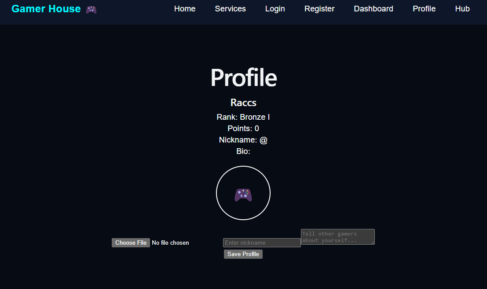

# 🎮 Gamer House

Gamer House is a modern gaming platform built with React and Vite. It provides a sleek interface where gamers can manage their profiles, explore gaming content, and prepare for future features like tournaments, leaderboards, and game libraries.

## 🚀 Features

- User authentication
- Dashboard
- User profile
- Game Hub
- Store page
- Library page
- Responsive UI
- Modern gaming design

## 🛠 Technologies Used

- React
- Vite
- React Router
- CSS3
- JavaScript

## 📂 Installation

Clone the repository:

```bash
git clone https://github.com/emmanueleffiom53-arch/gamer-house.git
```

Install dependencies:

```bash
npm install
```

Start the development server:

```bash
npm run dev
```

## 📌 Future Improvements

- Firebase Authentication
- Online Multiplayer
- Tournament System
- Leaderboards
- Live Gaming News API
- Chat System

## 👨‍💻 Author

Emmanuel Akim-Umoh
## 📸 Screenshots

### Home


### Dashboard


### Profile

